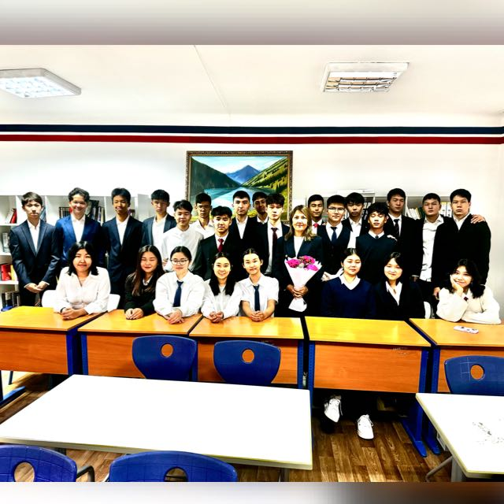

<!DOCTYPE html>
<html lang="kk">
<head>
    <meta charset="UTF-8">
    <meta name="viewport" content="width=device-width, initial-scale=1.0">
    <title>10"A"сынып</title>
    <link rel="stylesheet" href="css/styles.css">
    
</head>
<body>
    <header>
        <nav>
            
            <ul class="nav-links">
                <li><a href="#about">Сынып туралы</a></li>
                <li><a href="#students">Оқушылар</a></li>
                <li><a href="#achievements">Жетістіктер</a></li>
            </ul>
        </nav>
    </header>
    <section id="about" class="about">
        <h1>10-сынып туралы</h1>
        
РФММ мектебінің 10 “А” сыныбында қазіргі таңда 25 оқушы бар. Сынып жетекшісі Шынар Байтуяковна.
         Біз екі топқа бөлінгенбіз:
            • 1-топта – 13 оқушы
            • 2-топта – 12 оқушы  
        Сыныптың тарихы
        Біз 2021 жылы, 7-сыныпқа келгенде 28 оқушы едік. Алайда, уақыт өте келе, 7 оқушы түрлі себептермен мектептен кетті.
        Бірақ олардың орнына жаңа оқушылар қосылып, қазір 25 адамнан тұратын мықты сыныпқа айналдық.
        Класс жетекшілеріміз
            • 7-сыныпта біздің сынып жетекшіміз – Камилла Асқаровна болды.
            • 8-сыныптан бастап – Шынар Байтуяковна біздің жаңа жетекшіміз атанды.
        Біздің сынып – ерекше, мықты әрі ұйымшыл. Біз әрқашан бір-бірімізге қолдау көрсетіп, алға ұмтыламыз!

        <h2>Сынып суреті</h2>
        
    </section>
    <section id="students" class="students">
        <h2>Оқушылар</h2>
        

            

                <h3><a href="adiya.htm" target="_blank">Адия</a></h3>
            

            

                <h3><a href="inform3.html" target="_blank">Алуа</a></h3>
            

            

                <h3><a href="erasyl1" target="_blank">Ерасыл</a></h3>
            

            

                <h3><a href="зангар.html" target="_blank">Заңғар С.</a></h3>
            

            

                <h3><a href="зангар2.html" target="_blank">Заңғар М.</a></h3>
            

            

                <h3><a href="portfolioKAINAR.html" target="_blank">Қайнар</a></h3>
            

            

                <h3><a href="қайрат.html" target="_blank">Қайрат</a></h3>
            

            

                <h3><a href="қуаныш.html" target="_blank">Қуаныш</a></h3>
            

            

                <h3><a href="moldir.html" target="_blank">Мөлдір</a></h3>
            

            

                <h3><a href="malikaaa.html" target="_blank">Малика</a></h3>
            

            

                <h3><a href="portfolio.html" target="_blank">Мансұр</a></h3>
            

            

                <h3><a href="omirbek.html" target="_blank">Өмірбек</a></h3>
            

        

    </section>
    <section id="achievements" class="achievements">
        <h2>Жетістіктер</h2>
        <ul>
            <li>🏆 Республиканский этап Hippo Olympiad 2 место</li>
            <li>🏆 Республиканская Олимпиады( Областной этап) 2 Х третье место</li>
            <li>🏆 IMEC онлайн математика олимпиадасында қола жүлдеге ие болды, IMEC 5-санатында.</li>
            <li>🏆 2024 жылғы 25 қарашада өткен Junior English Olympics біліктілік кезеңінде күміс жүлдеге ие болды.</li>
            <li>🏆 грепплинг, джиу-джитсудан Koktem Open жарысында 🥇🥇 орын</li>
            <li>🏆 грепплингтан Алматы қаласында өткен UWW ЧРҚ-дан 2 орын 🥈</li>
            <li>🏆 репплингтан Ташкент қаласында өткен Азия чемпионатынан 1 орын 🥇</li>
        </ul>
    </section>
</body>
</html>
