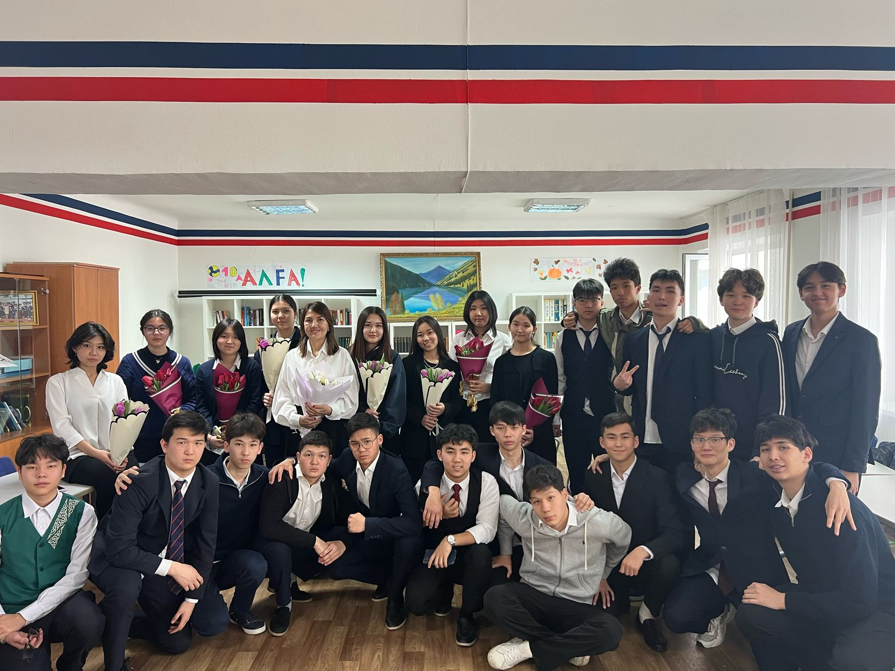

<html lang="kk">
<head>
    <meta charset="UTF-8">
    <meta name="viewport" content="width=device-width, initial-scale=1.0">
    <title>10"A" сынып</title>
    <link rel="stylesheet" href="css/styles.css">
    
</head>
<body>
    <header>
        <nav>
            <ul class="nav-links">
                <li><a href="#about">Сынып туралы</a></li>
                <li><a href="#students">Оқушылар</a></li>
                <li><a href="#achievements">Жетістіктер</a></li>
            </ul>
        </nav>
    </header>
    <section id="about" class="about">
        <h1>10-сынып туралы</h1>
        
РФММ мектебінің 10 “А” сыныбында қазіргі таңда 25 оқушы бар...

        <h2>Сынып суреті</h2>
        
    </section>
    <section id="students" class="students">
        <h2>Оқушылар</h2>
        

            

                <h3><a href="adiya.htm" target="_blank">Адия</a></h3>
            

            

                <h3><a href="inform3.html" target="_blank">Алуа</a></h3>
            

            

                <h3><a href="erasyl1.htm" target="_blank">Ерасыл</a></h3>
            

        

    </section>
    <section id="achievements" class="achievements">
        <h2>Жетістіктер</h2>
        <ul>
            <li>🏆 Республиканский этап Hippo Olympiad 2 место</li>
            <li>🏆 IMEC онлайн математика олимпиадасында қола жүлде</li>
        </ul>
    </section>
</body>
</html>
